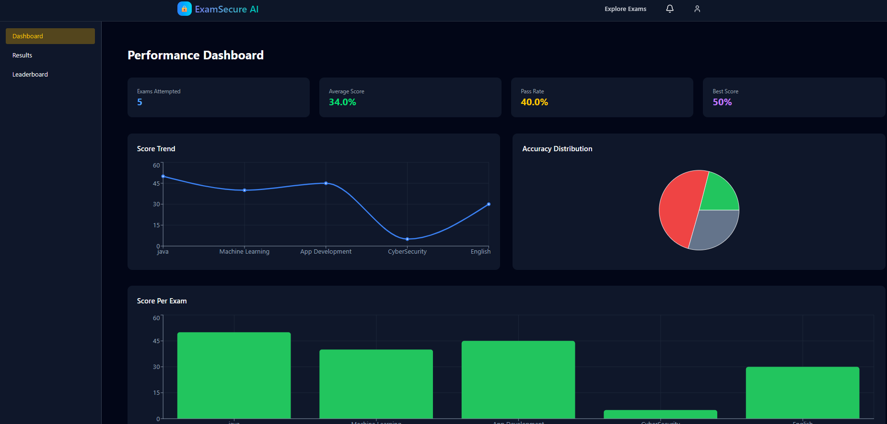
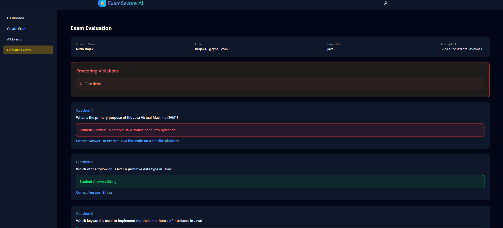
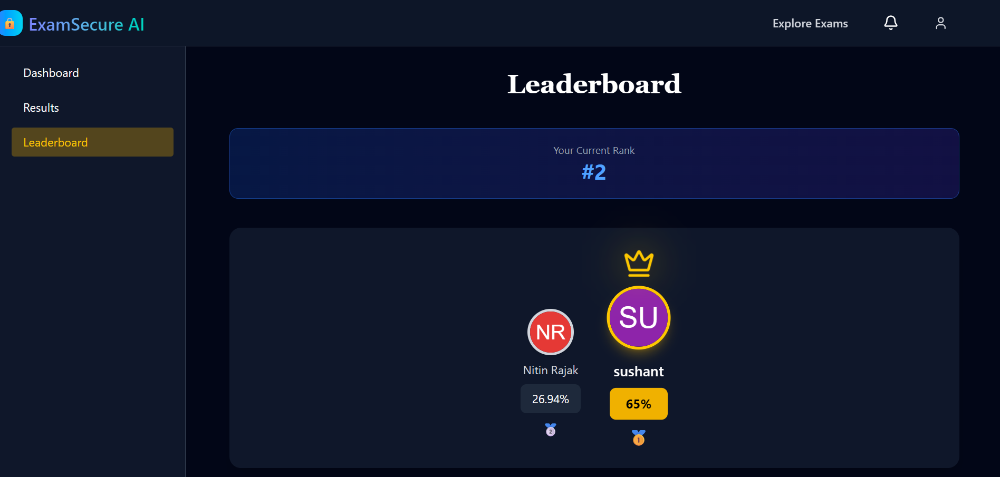
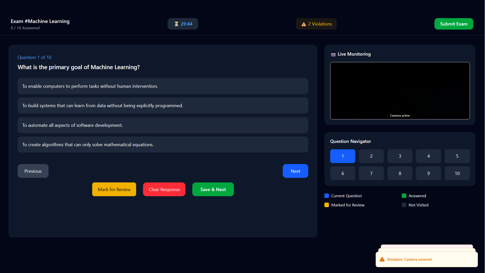
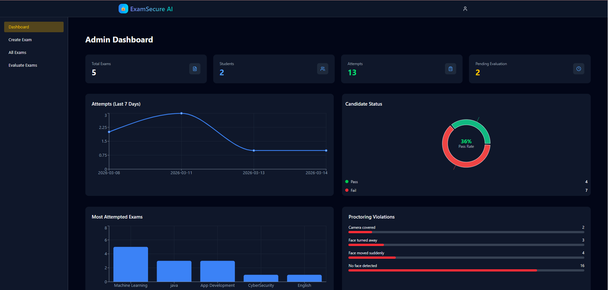

# 🧠 AI Proctored Online Examination Platform

A full-stack **AI-assisted Online Examination System** that allows institutes to conduct secure online exams with **AI proctoring, automated evaluation, analytics dashboards, leaderboard, and real-time notifications**.

Built using the **MERN Stack + Socket.IO**, this platform provides a modern SaaS-style interface for both **students and administrators**.

---

# 🚀 Features

## 👨‍🎓 Student Features

- View available exams
- Start exam with **AI Proctoring**
- Fullscreen enforcement
- Tab-switch detection
- Automatic exam submission on:
  - Time expiration
  - Exceeding violation limit
  - Exiting fullscreen
- MCQ and subjective questions
- Detailed exam analytics
- Leaderboard ranking
- Real-time notifications
- Profile settings
- Exam history and results dashboard

---

## 👨‍💼 Admin Features

- Admin analytics dashboard
- Create and manage exams
- Add MCQ and subjective questions
- Evaluate subjective answers
- Publish results
- Monitor proctoring violations
- View leaderboard statistics
- View student performance analytics

---

# 🛡 AI Proctoring Features

The system includes **basic AI-based exam monitoring** using the webcam:

- Face detection
- Multiple face detection
- Face movement detection
- Tab switch detection
- Fullscreen enforcement
- Violation logging
- Auto submission on excessive violations

These mechanisms help maintain **exam integrity**.

---

# 🔔 Real-Time Notification System

The platform uses **Socket.IO** to deliver real-time notifications.

Students receive notifications for:

- Exam results published
- New exams available

Features include:

- Real-time updates
- Notification history
- Read/unread tracking

---

# 🏆 Leaderboard System

Students are ranked based on:

- Average exam percentage
- Number of exams attempted

Leaderboard UI includes:

- Podium layout (Top 3)
- Full ranking table
- Current user highlighting
- Animated crown effect for #1

---

# 📊 Analytics Dashboards

## Student Dashboard

Shows personal performance analytics:

- Accuracy rate
- Completion rate
- Exam progress
- Score distribution
- Performance insights

Charts implemented using **Recharts**.

---

## Admin Dashboard

Shows platform-wide statistics:

- Total students
- Total exams
- Exam attempts
- Pass vs Fail statistics
- Popular exams
- Violation statistics

---

# ⚙️ Tech Stack

## Frontend

- React.js
- Redux Toolkit
- TailwindCSS
- Recharts
- Lucide Icons
- React Router
- Sonner (Toast Notifications)

---

## Backend

- Node.js
- Express.js
- MongoDB
- Mongoose
- JWT Authentication
- Bcrypt Password Hashing

---

## Real-Time Communication

- Socket.IO

Used for:

- Notifications
- Live updates

---

## AI Proctoring

- face-api.js
- WebRTC camera access
- Browser Fullscreen API
- Tab visibility detection


# 🔐 Authentication

Authentication is implemented using **JWT tokens**.

Supported roles:

- Student
- Admin

Protected routes ensure secure access control.

---

# 📸 Screenshots


  
  




# 🛠 Installation

## Clone the Repository

```bash
git clone https://github.com/your-username/ai-proctored-exam-system.git
```


